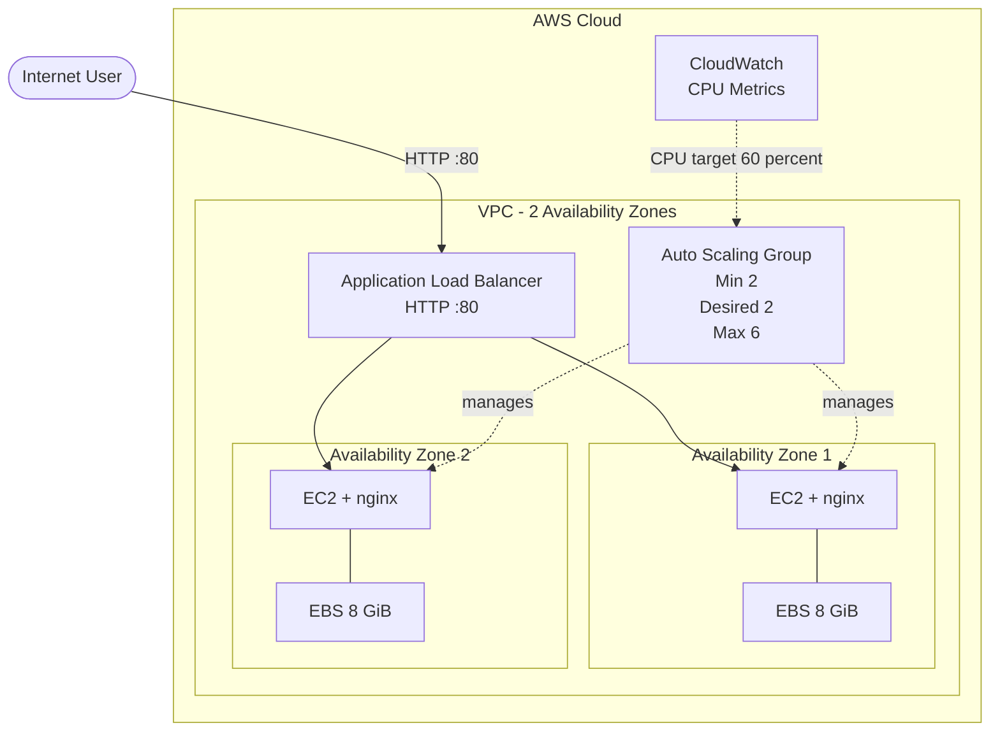

# High Demand Platform

A high-demand web application deployed on AWS using **AWS CDK**, with load balancing, high availability, and automatic scaling.

## Architecture



## Stack

* AWS CDK
* Amazon VPC
* Application Load Balancer
* Amazon EC2
* Auto Scaling Group
* Amazon EBS
* Amazon CloudWatch
* AWS IAM
* Amazon Linux 2023
* nginx
* TypeScript

## Key Configuration

* **2 Availability Zones**
* **2 initial instances**
* Auto Scaling: **2–6 instances**
* CPU target: **60%**
* Public Application Load Balancer on HTTP `:80`
* EC2 instances accessible only from the ALB
* **8 GiB encrypted EBS** volumes
* No NAT Gateway to reduce costs
* Minimal IAM permissions

## User Data

Each EC2 instance automatically installs nginx and displays:

* Instance ID
* Availability Zone

This makes it easy to verify load balancing across instances and Availability Zones.

## Deployment

### Prerequisites

* Node.js
* AWS CLI
* AWS CDK
* Configured AWS credentials

### Install dependencies

```bash
npm install
```

### Synthesize

```bash
cdk synth
```

### Deploy

```bash
cdk deploy
```

CDK outputs the Application Load Balancer URL after deployment.

## Validation

### Load Balancing

Open the ALB URL:

```text
http://<load-balancer-dns>
```

Refresh the page to see requests served by different EC2 instances and Availability Zones.

### Fault Tolerance

Terminate an EC2 instance from the AWS Console.

The Auto Scaling Group automatically launches a replacement instance.

### Auto Scaling

The ASG uses CPU target tracking with a **60% target**. Increased CPU utilization can trigger automatic scale-out up to the configured maximum of 6 instances.

## Security

```text
Internet
   ↓
ALB :80
   ↓
EC2 :80
```

* The ALB accepts HTTP traffic from the Internet.
* EC2 instances accept HTTP traffic only from the ALB Security Group.
* Direct HTTP access to EC2 instances is blocked.

## Cleanup

Remove all resources with:

```bash
cdk destroy
```

## Result

The project implements a **load-balanced, fault-tolerant, and auto-scaling web application** using AWS CDK and Infrastructure as Code.
